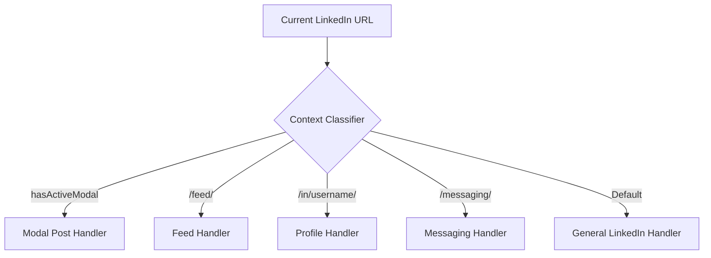

# 📘 Toystaller Technical Specification & Deep Architecture Guide

> **Main Global Multi-Platform Repository:** [https://github.com/SudiptaSanki/Toystaller](https://github.com/SudiptaSanki/Toystaller)  
> **LinkedIn Specialized Repository:** [https://github.com/SudiptaSanki/Toystaller-LinkedIn](https://github.com/SudiptaSanki/Toystaller-LinkedIn)  
> **Version:** 6.0 (Specialized Edition)  
> **Specification Target:** Chromium Manifest V3

---

## 📑 Table of Contents
1. [Executive Summary & Motivation](#1-executive-summary--motivation)
2. [Why Standard Media Downloaders Fail on LinkedIn](#2-why-standard-media-downloaders-fail-on-linkedin)
3. [System Architecture Overview](#3-system-architecture-overview)
4. [Component Deep Dive](#4-component-deep-dive)
   - [4.1 Main World Execution & Page Interceptor](#41-main-world-execution--page-interceptor)
   - [4.2 DOM & React Fiber State Inspection Engine](#42-dom--react-fiber-state-inspection-engine)
   - [4.3 Dynamic Network Interception Pipeline](#43-dynamic-network-interception-pipeline)
   - [4.4 Content Script & Cross-World Messaging](#44-content-script--cross-world-messaging)
   - [4.5 Overlay Manager & Collision Resolution Engine](#45-overlay-manager--collision-resolution-engine)
   - [4.6 Modal Isolation & Zero-Bleed Backdrop Engine](#46-modal-isolation--zero-bleed-backdrop-engine)
   - [4.7 LinkedIn CDN URL Upgrading](#47-linkedin-cdn-url-upgrading)
   - [4.8 Background Service Worker & Download Pipeline](#48-background-service-worker--download-pipeline)
5. [LinkedIn Section-by-Section Handler Matrix](#5-linkedin-section-by-section-handler-matrix)
6. [Performance, Memory & Lifecycle Optimization](#6-performance-memory--lifecycle-optimization)
7. [Security, Sandboxing & Privacy Guarantees](#7-security-sandboxing--privacy-guarantees)
8. [Comparison with Alternative Approaches](#8-comparison-with-alternative-approaches)
9. [Global Multi-Platform Ecosystem](#9-global-multi-platform-ecosystem)

---

## 1. Executive Summary & Motivation

**Toystaller** was created to solve a fundamental problem in the modern web: **access to original, uncompressed user media**. Social media networks such as LinkedIn employ sophisticated client-side rendering engines, dynamic adaptive streaming (DASH/HLS), and blob-based video players to obscure direct media sources.

Traditional approaches either:
1. Require users to copy URLs and paste them into third-party websites loaded with advertisements, trackers, and aggressive rate limits.
2. Rely on scraping public video tags from the DOM, which only exposes low-bitrate blob URLs or heavily compressed video segments.
3. Query external server-side APIs that frequently break whenever LinkedIn updates its internal Voyager API schemas.

**Toystaller operates entirely within the client's browser**, non-destructively reading memory states and network buffers that the official LinkedIn web client has already authenticated and decrypted.

---

## 2. Why Standard Media Downloaders Fail on LinkedIn

LinkedIn's web client implements multiple anti-scraping and optimization layers:

```
[User Browser]
   ├── 1. Blob URLs: <video src="blob:https://linkedin.com/xyz...">
   │      └── Direct download returns 0-byte or corrupted stream.
   ├── 2. DASH Segmentation: Video streams are split via DASH manifests (.mpd).
   ├── 3. Custom DOM Overlay Layers: Transparent divs layer over <video>,
   │      intercepting all right-click and context menu events.
   ├── 4. CDN 403 Restrictions: Requests to media.licdn.com with external
   │      referrers or improper cookies may trigger HTTP 403 Forbidden.
   └── 5. Single-Page Navigation (SPA): Posts opened from feed render
          as modals without a full page reload, leaving background media active.
```

Toystaller bypasses all five barriers directly at the browser runtime level without modifying LinkedIn's original DOM or triggering anti-bot heuristics.

---

## 3. System Architecture Overview

```
+-----------------------------------------------------------------------------------+
| CHROMIUM BROWSER RUNTIME                                                          |
|                                                                                   |
|  +-----------------------------------------------------------------------------+  |
|  | MAIN WORLD (Page Context - window)                                         |  |
|  |                                                                             |  |
|  |   [ LinkedIn Web Application ]                                             |  |
|  |      │                                                                      |  |
|  |      ├─── DOM data-sources Attribute (video progressive URLs)              |  |
|  |      ├─── React Fiber Tree (__reactFiber$, __reactProps$)                   |  |
|  |      │       ▲                                                              |  |
|  |      │       │ [Deep Object Traversal Engine]                               |  |
|  |      │   [ interceptor_core.js + platform.js ]                              |  |
|  |      │       ▲                                                              |  |
|  |      └─── Network Hooks (window.fetch, window.XMLHttpRequest)               |  |
|  |              │                                                              |  |
|  |              ▼ window.postMessage                                           |  |
|  +--------------┼--------------------------------------------------------------+  |
|                 │                                                                 |
|  +--------------┼--------------------------------------------------------------+  |
|  | ISOLATED CONTENT SCRIPT WORLD                                               |  |
|  |              ▼                                                              |  |
|  |   [ content_core.js ] ◄───► [ platform.js (LinkedIn config) ]               |  |
|  |          │                                                                  |  |
|  |          ▼                                                                  |  |
|  |   [ overlay_manager.js ]                                                     |  |
|  |      ├── MutationObserver (Modal Dialog Detection)                          |  |
|  |      ├── IntersectionObserver (Media Viewport Tracking)                     |  |
|  |      ├── ResizeObserver (Dynamic Element Relocation)                        |  |
|  |      └── elementsFromPoint (Occlusion & Hover Hit Testing)                  |  |
|  |              │                                                              |  |
|  |              ▼ chrome.runtime.sendMessage                                   |  |
|  +--------------┼--------------------------------------------------------------+  |
|                 │                                                                 |
|  +--------------┼--------------------------------------------------------------+  |
|  | BACKGROUND SERVICE WORKER                                                   |  |
|  |              ▼                                                              |  |
|  |   [ background_core.js ]                                                    |  |
|  |      ├── chrome.downloads.download() ───► [ Local File System ]             |  |
|  |      ├── chrome.tabs.create()         ───► [ HD Media New Tab ]             |  |
|  |      └── chrome.webRequest            ───► [ Network Monitoring ]           |  |
|  +-----------------------------------------------------------------------------+  |
+-----------------------------------------------------------------------------------+
```

---

## 4. Component Deep Dive

### 4.1 Main World Execution & Page Interceptor
Chrome extension content scripts run by default in an **Isolated World**. While this protects DOM integrity, it hides the page's actual JavaScript variables, React Fiber tree, and prototype chains (`window.fetch`, `window.XMLHttpRequest`).

Toystaller dynamically injects `platform.js` and `interceptor_core.js` directly into the **MAIN world** using standard script tag injection at `document_start`:

```javascript
const script = document.createElement('script');
script.src = chrome.runtime.getURL('platform.js');
(document.head || document.documentElement).appendChild(script);
script.remove();
```

### 4.2 DOM & React Fiber State Inspection Engine
LinkedIn stores video playback data in two key locations:

**1. DOM `data-sources` Attribute:**
LinkedIn `<video>` elements often contain a `data-sources` JSON attribute listing all available progressive streams with bitrate metadata:
```json
[
  {"src": "https://dms.licdn.com/.../video.mp4", "type": "video/mp4", "data-bitrate": "3000000"},
  {"src": "https://dms.licdn.com/.../video.mp4", "type": "video/mp4", "data-bitrate": "1500000"}
]
```
Toystaller's `extractVideoUrlFromDOM()` parses this JSON, filters out DASH manifests and HLS playlists, and selects the highest-bitrate progressive MP4 stream.

**2. React Fiber & Voyager API Properties:**
When a user hovers or clicks a media item:
1. The extension queries the target `<video>` or `` DOM node.
2. Traverses parent ancestors up to 12 levels in the DOM tree looking for Fiber instances.
3. Recursively scans the Fiber state tree for candidate fields:
   - `streamingUrl`: High-bandwidth progressive MP4 stream URL.
   - `progressiveUrl`: Direct progressive download link.
   - `height`: Resolution metadata for quality selection.

### 4.3 Dynamic Network Interception Pipeline
In addition to DOM inspection, `interceptor_core.js` monkey-patches `window.fetch` and `window.XMLHttpRequest` at runtime:
- Watches for responses from `linkedin.com`, `/api/v`, `voyager/api`, and `dms.licdn.com`.
- Clones responses asynchronously without blocking page performance.
- Parses JSON payloads in real time, harvesting valid video and image CDN URLs into an indexed memory set.
- Automatically rejects thumbnail covers, DASH manifests (`.mpd`), and segmented chunks (`bytestart/byteend`) using an intelligent scoring algorithm:
  $$\text{Score} = +10(\text{.mp4}) + 20(\text{1080p}) + 10(\text{720p}) - 50(\text{dash}) - 500(\text{thumbnail})$$

### 4.4 Content Script & Cross-World Messaging
Because the MAIN world interceptor and the Content Script live in different execution contexts, communication is handled via bi-directional asynchronous `window.postMessage` channels with unique random transaction IDs (`magic_get_react_url` ➔ `magic_response_react_url_${id}`) with a 350ms safety timeout fallback.

### 4.5 Overlay Manager & Collision Resolution Engine
Rather than altering LinkedIn's fragile layout by appending child elements inside `<video>` wrappers, `OverlayManager` appends all UI elements to `document.body` with `position: fixed` and `z-index: 2147483646`.

Key features:
- **`ResizeObserver`**: Instantly tracks changes in media dimensions and viewport scaling.
- **`IntersectionObserver`**: Deactivates overlays for off-screen media (threshold: 15%).
- **Collision Avoidance (`cornerHasConflict`)**: Detects native LinkedIn interactive controls (Like, Comment, Share, Reactions) and automatically shifts buttons to alternative corners (`top-left` ➔ `top-right` ➔ `bottom-right`).

### 4.6 Modal Isolation & Zero-Bleed Backdrop Engine
On LinkedIn, clicking media or images can open `.artdeco-modal` or `[role="dialog"]` modals over the existing feed content.

**The Zero-Bleed Solution:**
1. A real-time `MutationObserver` on `document.body` monitors modal creation/removal (watching `role`, `aria-modal`, and `class` attribute changes).
2. When a modal opens (`hasActiveModal() === true`), all background overlays outside the modal are immediately forced to `display: none; visibility: hidden; pointer-events: none;`.
3. Pointer hit testing (`document.elementsFromPoint`) verifies that cursor coordinates directly intersect with the active modal media before allowing any overlay to display.

### 4.7 LinkedIn CDN URL Upgrading
LinkedIn serves images at multiple resolutions through their CDN (`media.licdn.com/dms/image`). The URL contains resolution parameters like `/100/`, `/200/`, `/400/`, `/800/`.

Toystaller's `upgradeImageUrl()` function automatically rewrites these to `/1000/` to request the highest available resolution:
```javascript
upgradeImageUrl(url) {
    if (url && url.includes('media.licdn.com/dms/image')) {
        return url.replace(/\/(100|200|400|800)\//g, '/1000/');
    }
    return url;
}
```

### 4.8 Background Service Worker & Download Pipeline
The background service worker (`background_core.js`) provides three core services:
1. **Network Monitoring**: `chrome.webRequest.onResponseStarted` tracks all video and image URLs loaded by the tab for fallback URL resolution.
2. **New Tab Opening**: `chrome.tabs.create()` opens high-quality media in a clean new browser tab.
3. **Download Pipeline**: `chrome.downloads.download()` with `saveAs: true` for cases where direct download is required.

---

## 5. LinkedIn Section-by-Section Handler Matrix



| Section | Detection Rule | Target Strategy | Filter Strategy |
| :--- | :--- | :--- | :--- |
| **Modal Dialog** | `.artdeco-modal, [role="dialog"]` (size > 400×400) | Modal-contained media only | Rejects all background feed items |
| **Feed** | `/feed/` | Post images (`naturalW ≥ 200`), native videos | Rejects circular profile pictures (`border-radius: 50%`), icons `< 100px` |
| **Profile** | `/in/<username>/` | Profile photo, banner, shared media | Rejects small UI icons and connection avatars |
| **Messaging** | `/messaging/` | Chat media attachments | Rejects conversation participant avatars |
| **General** | Any other LinkedIn page | Images ≥ 200×200, all video elements | Rejects thumbnails `< 100px`, circular avatars |

---

## 6. Performance, Memory & Lifecycle Optimization

- **Throttled Pointer Events**: Mousemove handlers are throttled to 30ms intervals to eliminate frame drops and maintain 60/120fps scrolling.
- **Garbage Collection Safety**: DOM nodes are tracked in `Map` collections; when media elements are detached from the DOM, their corresponding observers and overlay containers are disconnected and removed.
- **Context Invalidation Protection**: All background messaging calls are wrapped in `safeSendMessage` try-catch blocks to prevent console warnings when the extension is updated or reloaded during an active session.

---

## 7. Security, Sandboxing & Privacy Guarantees

1. **Zero External Communication**: The extension never makes network calls to external analytical, tracking, or proxy servers. All requests remain within `linkedin.com` and `licdn.com`.
2. **Read-Only Inspection**: React Fiber states and Voyager API responses are read in memory without modifying client-side session tokens, cookies, or account credentials.
3. **Shadow DOM Isolation**: The dashboard UI is rendered inside a closed-mode `ShadowRoot`, completely immune to host page CSS pollution.

---

## 8. Comparison with Alternative Approaches

| Feature / Metric | Toystaller for LinkedIn | Generic Web Scraper / Web Tools | DOM Video Scraping Extensions |
| :--- | :--- | :--- | :--- |
| **Video Quality** | **Progressive MP4 / Highest Bitrate** | Often capped at low quality | Capped at compressed blob preview |
| **Image Resolution** | **Maximum CDN Resolution (auto-upgraded)** | Compressed JPEG | Screen-size cropped preview |
| **Account Safety** | **100% Safe (Local client-side)** | High risk (Requires login/cookies) | Safe |
| **Speed** | **Instant (0 ms network overhead)** | Slow (Server processing time) | Instant |
| **Advertisements / Trackers** | **None (Zero)** | Heavy Adware / Popups | Minimal |
| **Private Content Support** | **Yes (If visible in your feed)** | No | Limited |

---

## 9. Global Multi-Platform Ecosystem

Toystaller was engineered as a modular framework. While this repository represents the **specialized standalone edition for LinkedIn**, the **Main Global Repository** provides multi-platform capabilities across the entire social web:

- 📷 **Instagram**: Reels, Stories, High-Res Posts, Profile Avatars, DMs.
- 💼 **LinkedIn**: Uncompressed Document Images, Native Video Streams.
- 📘 **Facebook**: Mobile & Desktop Progressive Video Extraction, High-Res Photos.
- 💬 **WhatsApp Web**: Full-Resolution Media Attachments & Voice Notes.

👉 **Explore the Main Project:** [https://github.com/SudiptaSanki/Toystaller](https://github.com/SudiptaSanki/Toystaller)

---

<div align="center">
<b>Toystaller Architecture Documentation</b> • Maintained by <a href="https://github.com/SudiptaSanki">Sudipta Sanki</a>
</div>
