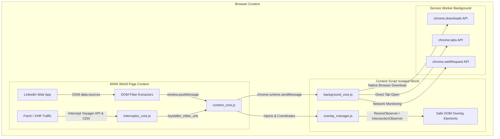

<div align="center">

# 🧸 Toystaller for LinkedIn (v6.0)

**High-Performance, Stealth Media Downloader & Media Viewer for LinkedIn**

[](https://developer.chrome.com/docs/extensions/mv3/intro/)
[](https://linkedin.com)
[](https://github.com/SudiptaSanki/Toystaller)
[](LICENSE)
[](DETAILS.md)

*A specialized, client-side Chromium extension that extracts original high-resolution images and progressive MP4 video streams from LinkedIn Feed, Profiles, Articles, and Messaging without external APIs or compression.*

---

### 🌐 Official Repositories & Documentation
* **Main Global Multi-Platform Suite:** [https://github.com/SudiptaSanki/Toystaller](https://github.com/SudiptaSanki/Toystaller) *(Instagram, Facebook, LinkedIn, WhatsApp)*
* **LinkedIn Specialized Edition:** [https://github.com/SudiptaSanki/Toystaller-LinkedIn](https://github.com/SudiptaSanki/Toystaller-LinkedIn)
* **Deep Technical Specification & Architecture:** [`DETAILS.md`](DETAILS.md)

</div>

---

##  Overview

**Toystaller for LinkedIn** is an advanced browser extension engineered specifically for LinkedIn's modern single-page application. Traditional downloaders rely on server-side scrapers that require you to paste links into ad-filled websites, or they scrape low-resolution preview URLs from the DOM.

Toystaller operates **100% client-side** inside your browser. It directly accesses LinkedIn's internal data structures, `data-sources` attributes, and network buffers to extract the original, full-resolution progressive MP4 videos and maximum-quality photos directly from LinkedIn's official CDN (`*.licdn.com`).

---

## Features & Section Support

| LinkedIn Section | Supported Media | Extraction Capability | UI & Behavior |
| :--- | :--- | :--- | :--- |
| **Feed (`/feed/`)** | Images, Native Videos, Shared Articles | Full-res photos via CDN URL upgrading, progressive MP4 streams | Hover over post media for unobtrusive buttons |
| **Profile (`/in/<username>/`)** | Profile Photos, Background Banners, Shared Media | High-res image extraction with automatic resolution upgrading | Buttons on all profile media; circular avatars filtered out |
| **Modals (`.artdeco-modal`, `[role="dialog"]`)** | Expanded Images, Video Players | Maximum quality media from modal context | **Zero-Bleed Isolation**: Background overlays suppressed when modal is open |
| **Articles & Posts** | Embedded Images, Document Slides, Video Attachments | Original quality document images and video streams | Smart corner placement avoiding LinkedIn controls |
| **Messaging (`/messaging/`)** | Shared Photos & Videos | Original quality media attachments | Compact button scaling; ignores conversation avatars |

---

## 🛠️ Technology Stack & Architecture

Toystaller is built from the ground up with **Pure Modern Vanilla JavaScript** (ES2022+), zero third-party dependencies, and adheres strictly to **Google Chrome Manifest V3 specifications**.



### Core Technologies:
1. **Manifest V3 Service Worker (`background_core.js`)**:
   - Manages asynchronous download pipelines via `chrome.downloads`.
   - Intercepts raw network response headers with `chrome.webRequest` for fallback URL tracking.
   - Opens high-quality media directly in new browser tabs via `chrome.tabs`.
2. **Main-World DOM & React Fiber Hooking (`interceptor_core.js`)**:
   - Accesses DOM elements' hidden `__reactFiber$` and `__reactProps$` internal keys.
   - LinkedIn-specific: Extracts `data-sources` attribute from `<video>` elements for progressive MP4 URLs with bitrate selection.
   - Harvests `streamingUrl` and `progressiveUrl` from Voyager API responses.
3. **Network Interceptor (`interceptor_core.js`)**:
   - Overrides `window.fetch` and `window.XMLHttpRequest` in the page context.
   - Captures LinkedIn Voyager API and media query responses for video URL discovery.
4. **LinkedIn CDN URL Upgrading (`platform.js`)**:
   - Automatically upgrades image resolution by replacing LinkedIn CDN size parameters (`/100/`, `/200/`, `/400/`) with `/1000/` for maximum quality.
5. **Geometry & Occlusion Engine (`overlay_manager.js`)**:
   - Uses `IntersectionObserver`, `ResizeObserver`, and `document.elementsFromPoint` hit testing.
   - Dynamically calculates best corner placement avoiding native LinkedIn controls.
   - Real-time `MutationObserver` on modal dialogs (`.artdeco-modal`) to prevent overlay bleed across layers.
6. **Isolated Settings Dashboard (Shadow DOM)**:
   - Floating dark-mode control center rendered inside an isolated `ShadowRoot` to prevent any CSS interference from LinkedIn's stylesheets.

*(For exhaustive architectural diagrams and algorithms, read [`DETAILS.md`](DETAILS.md)).*

---

## Detailed Installation Guide (Step-by-Step)

To install and run **Toystaller for LinkedIn** on any Chromium-based browser (Google Chrome, Brave, Microsoft Edge, Opera, Vivaldi, Arc):

### Prerequisites
- Any modern Chromium browser (Chrome 102+ recommended).
- Git installed on your machine (or download the source ZIP).

---

### Step 1: Clone or Download the Repository
Run the following command in your terminal:
```bash
git clone https://github.com/SudiptaSanki/Toystaller-LinkedIn.git
```
*Or click **Code ➔ Download ZIP** on GitHub and extract the folder to your preferred directory.*

---

### Step 2: Open Browser Extensions Page
1. Open your Chromium browser.
2. In the URL address bar, enter the corresponding URL:
   - **Google Chrome**: `chrome://extensions/`
   - **Brave Browser**: `brave://extensions/`
   - **Microsoft Edge**: `edge://extensions/`
   - **Opera**: `opera://extensions/`

---

### Step 3: Enable Developer Mode
Look in the top-right corner of the Extensions page and toggle the switch labeled **Developer mode** to **ON**.

```
[ Developer mode ]  <--- (Toggle this to ON)
```

---

### Step 4: Load Unpacked Extension
1. Click on the **Load unpacked** button in the top-left toolbar.
2. In the folder selection dialog, navigate to and select the `Version 6/linkedIn/` directory:
   ```
   Toystaller-LinkedIn/Version 6/linkedIn/
   ```
   *(Ensure you select the folder containing `manifest.json`).*
3. Click **Select Folder** (or **Open**).

---

### Step 5: Pin and Verify the Extension
1. Click the **Puzzle icon** (Extensions menu) in your browser toolbar.
2. Locate **Toystaller for LinkedIn** and click the **Pin icon** to pin it to your toolbar.
3. Open [LinkedIn](https://www.linkedin.com/) or refresh any existing LinkedIn tab.
4. Hover over any post image, video, or profile picture — you will see the **Blue (Open Media)** and **Red (Open Poster)** overlay buttons!

---

##  How to Use

1. **Open Video in New Tab (Best Quality)**:
   - Hover over any video in the feed or a post.
   - Click the **Blue Button** with the arrow icon. The highest quality progressive MP4 link will open in a new tab for instant playback or saving (`Ctrl + S`).
2. **Open High-Res Photo in New Tab**:
   - Hover over any post image, document slide, or profile picture.
   - Click the **Blue Button** to open the maximum resolution photo (auto-upgraded to `/1000/` on LinkedIn CDN).
3. **Open Poster / Video Thumbnail**:
   - Hover over any video.
   - Click the **Red Button** to extract the full-size video cover artwork.
4. **Open Settings Dashboard**:
   - Click the Toystaller icon in your browser toolbar to toggle the dashboard overlay.

---

## 📂 Project Structure

```text
Toystaller-LinkedIn/
├── Version 6/
│   └── linkedIn/
│       ├── manifest.json          # Extension manifest (MV3, permissions, content scripts)
│       ├── background.js          # Background entry point (imports core)
│       ├── content.js             # Content script entry point (boots Toystaller)
│       ├── platform.js            # LinkedIn-specific section detector & quality extractors
│       ├── icon.png               # Extension branding & icons
│       └── core/                  # Modular core architecture
│           ├── background_core.js # Background Service Worker for downloads & webRequest
│           ├── content_core.js    # Content script orchestrator & button injection
│           ├── interceptor_core.js# Main-world Fetch/XHR interceptor & React Fiber reader
│           └── overlay_manager.js # Smart DOM positioning, collision & modal isolation
├── Toystaller_logo.png            # Project branding
├── DETAILS.md                     # Exhaustive technical documentation & architecture guide
├── CONTRIBUTING.md                # Contributing guidelines & architecture reference
├── LICENSE                        # MIT License
└── README.md                      # Project documentation & installation manual
```

---

## 🛡️ Privacy & Security

- **100% Client-Side**: No user data, cookies, authentication tokens, or media URLs are ever transmitted to external servers.
- **Zero Third-Party Trackers**: No analytics, telemetry, or third-party dependencies.
- **Direct CDN Streams**: Media files are fetched directly from LinkedIn's official CDN servers (`*.licdn.com`).

---

## 🤝 Contributing & Support

Contributions, feature suggestions, and bug reports are warmly welcome!
- Check out the **Main Global Repository** for multi-platform support (Instagram, Facebook, LinkedIn, WhatsApp): [https://github.com/SudiptaSanki/Toystaller](https://github.com/SudiptaSanki/Toystaller)
- Read the **Technical Architecture Guide**: [`DETAILS.md`](DETAILS.md)
- Open an Issue or Pull Request on [GitHub Issues](https://github.com/SudiptaSanki/Toystaller-LinkedIn/issues).

---

<!-- autobot:start -->
<!-- s:017723da t:2026-09-09T14:36:38.221Z a:updated dependencies b:1637 -->
<!-- autobot:end -->
